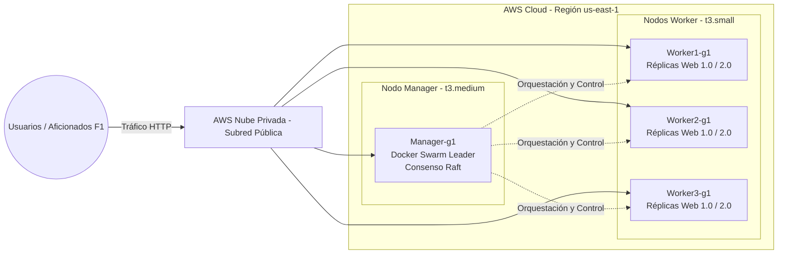

# Arquitectura del Clúster Docker Swarm - Fórmula 1 Euskadi

```mermaid
graph LR
    Client((Usuarios / Aficionados F1)) -->|Tráfico HTTP| VPC[AWS Nube Privada - Subred Pública]
    
    subgraph AWS Cloud - Región us-east-1
        subgraph Nodo Manager - t3.medium
            M1[Manager-g1 <br/> Docker Swarm Leader <br/> Consenso Raft]
        end
        
        subgraph Nodos Worker - t3.small
            W1[Worker1-g1 <br/> Réplicas Web 1.0 / 2.0]
            W2[Worker2-g1 <br/> Réplicas Web 1.0 / 2.0]
            W3[Worker3-g1 <br/> Réplicas Web 1.0 / 2.0]
        end
    end

    VPC --> M1
    VPC --> W1
    VPC --> W2
    VPC --> W3
    M1 -.->|Orquestación y Control| W1
    M1 -.->|Orquestación y Control| W2
    M1 -.->|Orquestación y Control| W3
```
